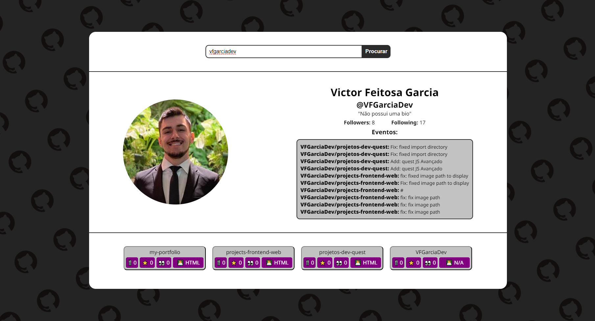
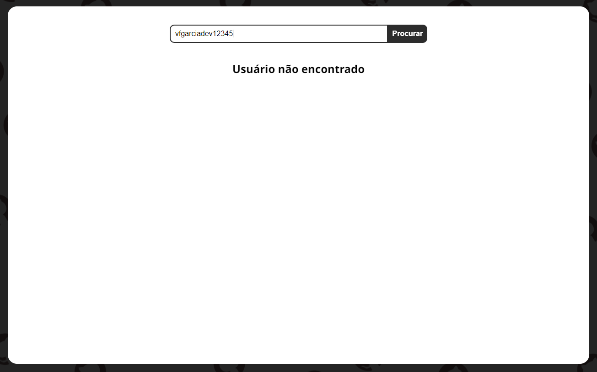

# API GitHub - busca por Usuários e Repositórios
Esse é um desafio orientado pelo [Dev em Dobro](https://www.linkedin.com/school/devquest-dev-em-dobro/). 

[](./README.en-template.md)

## Índice
- [Visão Geral](#visão-geral)
    - [Desafio](#desafio)
    - [Screenshot](#screenshot)
    - [Link](#link)
- [Meu Processo](#meu-processo)
    - [Ferramentas usadas](#ferramentas-usadas)
    - [O que eu aprendi?](#o-que-eu-aprendi)
    - [Conteudo a aprimorar](#conteudo-a-aprimorar)
    - [Recursos úteis](#recursos-úteis)
- [Autor](#autor)
- [Reconhecimento](#reconhecimento)   


## Visão Geral
### Desafio
Desafio orientado pelos professores do curso: Dev em Dobro. Com o intuito de demonstrarmos nosso conhecimento em JavaScript e APIs

### Screenshot
Visão geral sobre o projeto:


- Tela ao buscar um usuário existente no GitHub:


- Tela ao buscar um usuário não existente:


### Links
- Live URL (GitHub): [API GitHub](https://vfgarciadev.github.io/devquest-api-github/index.html)

- Repositório: [Repositório GitHub](https://github.com/VFGarciaDev/devquest-api-github)

## Meu processo
### Ferramentas usadas
- HTML5
- CSS3
- JavaScript
    - DOM e EventListener
    - Funções assíncronas
    - Try/Catch error
- [API GitHub](https://docs.github.com/en/rest?apiVersion=2022-11-28)
- Google Fonts & Dev icon

### O que eu aprendi?
Projeto foi focado em desenvolver meu conhecimento sobre JavaScript e RESTful APIs. Aprendi como melhor usar as funções assíncronas com async/await e then, fazer uso do try/catch para identificar erros e implementa-las juntas, além de também ter me aprofundado mais com o uso de APIs e suas Documentações.

```javascript
async function getUser(userName) {
    try{
        const response = await fetch(`https://api.github.com/users/${userName}`)
        if (!response.ok) {
            throw "Usuário não encontrado!"
        } else{
            return await response.json()
        }
    } catch(err){
        alert(err)
        htmlTags.userSection.innerHTML = `<h1>Usuário não encontrado</h1>`
    }
}
```

### Conteudo a aprimorar
Ainda assim, preciso me aprofundar mais nos conhecimentos sobre JavaScript, aprender novas funcionalidades e a reconhecer o melhor momento de implementação para cada funcionalidade. Também preciso me acostumar mais com o uso de APIs e aprender novas ferramentas para facilitar minha programação como React, TypeScript, etc.

### Recursos úteis
- [Google Fonts](https://fonts.google.com) - Uso da font: "Noto Sans"
- [DevIcons](https://devicon.dev) - Uso do ícone do GitHub para usar como Favicon e Background

## Autor
Meus links para entrar em contato:

- [LinkedIn](https://www.linkedin.com/in/victor-fgarcia)
- [GitHub](https://github.com/VFGarciaDev)
- [Instagram](https://www.instagram.com/vgarcia_00/)
- [E-mail](mailto:vfeitosa.garcia@gmail.com)

## Reconhecimento

Gostaria de agradecer a toda comunidade do Dev. Quest e, principalmente, a todos os Professores e Monitores do curso pelo desafio, conhecimento fornecido e auxílios durante o processo.
